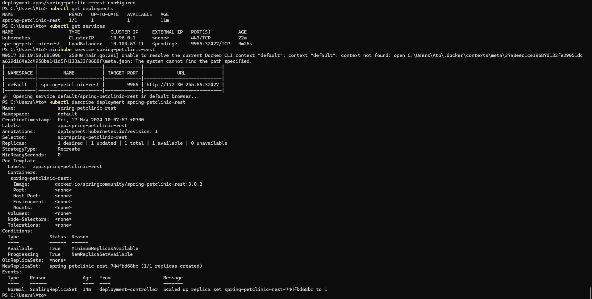

# tutorial-11-advprog

## Reflection on Hello Minikube

### Compare the application logs before and after you exposed it as a Service.
```
PS C:\Users\Ato> kubectl logs hello-node-55fdcd95bf-l8zc8
I0514 06:34:15.423085       1 log.go:195] Started HTTP server on port 8080
I0514 06:34:15.423382       1 log.go:195] Started UDP server on port  8081
PS C:\Users\Ato> kubectl expose deployment hello-node --type=LoadBalancer --port=8080
service/hello-node exposed
PS C:\Users\Ato> kubectl get services
NAME         TYPE           CLUSTER-IP     EXTERNAL-IP   PORT(S)          AGE
hello-node   LoadBalancer   10.107.40.86   <pending>     8080:31969/TCP   14s
kubernetes   ClusterIP      10.96.0.1      <none>        443/TCP          17h
PS C:\Users\Ato> minikube service hello-node
W0514 13:41:45.591560   23344 main.go:291] Unable to resolve the current Docker CLI context "default": context "default": context not found: open C:\Users\Ato\.docker\contexts\meta\37a8eec1ce19687d132fe29051dca629d164e2c4958ba141d5f4133a33f0688f\meta.json: The system cannot find the path specified.
|-----------|------------|-------------|-----------------------------|
| NAMESPACE |    NAME    | TARGET PORT |             URL             |
|-----------|------------|-------------|-----------------------------|
| default   | hello-node |        8080 | http://172.30.244.180:31969 |
|-----------|------------|-------------|-----------------------------|
🎉  Opening service default/hello-node in default browser...
PS C:\Users\Ato> kubectl logs hello-node-55fdcd95bf-l8zc8
I0514 06:34:15.423085       1 log.go:195] Started HTTP server on port 8080
I0514 06:34:15.423382       1 log.go:195] Started UDP server on port  8081
I0514 06:41:49.215859       1 log.go:195] GET /
I0514 06:41:49.532204       1 log.go:195] GET /
PS C:\Users\Ato> minikube service hello-node
W0514 14:04:18.313062   29976 main.go:291] Unable to resolve the current Docker CLI context "default": context "default": context not found: open C:\Users\Ato\.docker\contexts\meta\37a8eec1ce19687d132fe29051dca629d164e2c4958ba141d5f4133a33f0688f\meta.json: The system cannot find the path specified.
|-----------|------------|-------------|-----------------------------|
| NAMESPACE |    NAME    | TARGET PORT |             URL             |
|-----------|------------|-------------|-----------------------------|
| default   | hello-node |        8080 | http://172.30.244.180:31969 |
|-----------|------------|-------------|-----------------------------|
🎉  Opening service default/hello-node in default browser...
PS C:\Users\Ato> kubectl logs hello-node-55fdcd95bf-l8zc8
I0514 06:34:15.423085       1 log.go:195] Started HTTP server on port 8080
I0514 06:34:15.423382       1 log.go:195] Started UDP server on port  8081
I0514 06:41:49.215859       1 log.go:195] GET /
I0514 06:41:49.532204       1 log.go:195] GET /
I0514 07:04:27.686076       1 log.go:195] GET /
I0514 07:04:28.284392       1 log.go:195] GET /
I0514 07:04:28.311371       1 log.go:195] GET /
PS C:\Users\Ato>
```
Jumlah logs bertambah setelah mengakses servicenya

### What is the purpose of the `-n` option and why did the output not list the pods/services that you explicitly created?

-n digunakan untuk mengspesifikasikan namespace dalam menampilkan servies/resources. Dalam hal ini, kubectl get services -n kube-system akan menampilkan service dari namespace kube-system. Jika tidak menspesifikasikan namespace, maka servies yang akan ditampilkan berasal dari namespace `default`

## Reflection on Rolling Update & Kubernetes Manifest File

### What is the difference between Rolling Update and Recreate deployment strategy?

Perbedaannya terletak pada downtime yang ketika terdapat proses update. Dengan RollingUpdate, tidak terdapat downtime karena pod lama tetap berjalan, sedangkan pod baru dibuat satu per satu. Sedangkan dengan Recreate, semua pod akan dihentikan dan pod baru akan dibuat sehingga terdapat downtime

### Try deploying the Spring Petclinic REST using Recreate deployment strategy and document your attempt.

Sebelum menerapkan recreate deployement strategy:


Kemudian:





### Prepare different manifest files for executing Recreate deployment strategy

File recreate-deployment terdapat pada repository. file tersebut dibuat berdasarkan deployment.yaml tetapi dengan mengubah strategy nya menjadi Recreate

### What do you think are the benefits of using Kubernetes manifest files? Recall your experience in deploying the app manually and compare it to your experience when deploying the same app by applying the manifest files (i.e., invoking `kubectl apply -f` command) to the cluster.

Menggunakan kubernetese manifest files dapat memberikan beberapa benefit, yaitu:
- bisa mendukung proses automasi deployment sehingga menurunkan resiko human error. 
- Manfiest files bisa di-store juga di git. 
- Dengan menentukan manifest file, deployment bisa bersifat konsisten
- Manifest file dapat memberikan kesan dokumentasi pada prosedur deployment